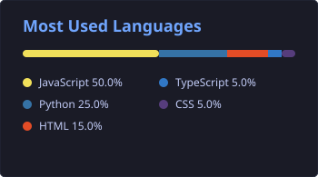
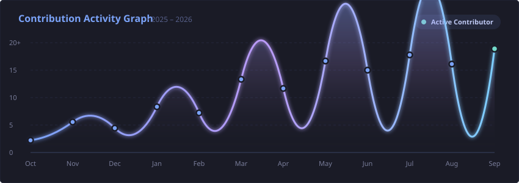

<div align="center">

# 👾 Pranjay's Dev Arcade 🕹️
### GenAI & Agentic AI Engineer | Cybersecurity Builder 🤖🛡️

<br/>

<table>
  <tr>
    <td align="center" width="260" valign="middle">
      
      <br/>
      <sub><b>PRANJAY SRIVASTAVA // DEV</b></sub>
    </td>
    <td align="center" valign="middle">
      
      <br/><br/>
      <a href="https://linkedin.com/in/pranjay-srivastava" target="_blank"></a>
      <a href="https://x.com/Pranjay178092" target="_blank"></a>
      <a href="https://github.com/PranjaySrivastava" target="_blank"></a>
      <a href="https://pranjay-3d-portfolio.vercel.app/" target="_blank"></a>
      <a href="mailto:pranjaySrivastava51@gmail.com"></a>
    </td>
  </tr>
</table>

</div>

---

### 🎮 Arcade Zone: Pac-Man Contribution Eater

<div align="center">
  
  <br/>
  <sub>🎮 <i>Pac-Man chomping through real GitHub contribution squares while evading Blinky & Pinky!</i></sub>
</div>

---

### 💫 Player Info & Mission Log

```yaml
player_tag: Pranjay Srivastava

class: GenAI & Agentic Systems Engineer | Cybersecurity Builder

perks:
  - Generative AI Architectures, LLMs & Multi-Agent Orchestration
  - Autonomous Agentic Workflows & Tool-Augmented RAG Pipelines
  - Full-Stack Development & Scalable Web Architecture
  - Cybersecurity, Ethical Hacking & Secure Systems Engineering
  - Algorithmic Problem Solving & Data Structures

current_quest: Engineering Autonomous Agentic Systems & Exploring GenAI × Cybersecurity

party_traits:
  - Hackathon Hustler
  - Agentic AI Architect
  - Cybersecurity Enthusiast
  - Open Source Builder
  - Problem Solver
```

---

### 🛠️ Tech Stack & Inventory

<p align="center"><b>Generative AI, Voice AI & Agentic Workflows</b></p>
<p align="center">
  
  
  
  
  
  
</p>

<p align="center"><b>Core Languages</b></p>
<p align="center">
  
</p>

<p align="center"><b>Frontend, 3D & UI</b></p>
<p align="center">
  
</p>

<p align="center"><b>Backend & APIs</b></p>
<p align="center">
  
</p>

<p align="center"><b>AI, Deep Learning & Computer Vision</b></p>
<p align="center">
  
</p>

<p align="center"><b>Cybersecurity & Ethical Hacking Tools</b></p>
<p align="center">
  
  
  
  
  
  
</p>

<p align="center"><b>Databases, Cloud & Tools</b></p>
<p align="center">
  
</p>

---

### 🚀 Featured Boss Raids (Flagship Projects)

| Project | Tech Stack | Mission Highlights | Code |
| :--- | :--- | :--- | :--- |
| **AI Teaching Assistant** | `React`, `Node.js`, `OpenAI`, `Web Speech API` | Interactive DSA learning platform with voice/text explanations, visual code animations, and targeted follow-ups. | [Source Code](https://github.com/PranjaySrivastava/AI-teaching-assistant) |
| **Voice-Enabled RAG Model** | `TypeScript`, `Python`, `Vector DB`, `LangChain` | Conversational RAG system querying private knowledge bases through natural voice commands. | [Source Code](https://github.com/PranjaySrivastava/voice_enabled_RAG_Model) |
| **CodeTrace** | `React`, `JavaScript`, `Tailwind` | Developer analytics dashboard tracking problem-solving journeys and identifying algorithmic weak spots. | [Source Code](https://github.com/PranjaySrivastava/codetrace) |
| **HH Goa Builder ID Generator** | `JavaScript`, `Canvas API`, `CSS3` | Client-side production generator creating official HH Goa 2026 PFP frames & builder credentials with instant X export. | [Source Code](https://github.com/PranjaySrivastava/HH-Goa-2026-Frame-ID-Card-Generator) |
| **3D Interactive Portfolio** | `Three.js`, `React`, `WebGL` | Immersive 3D developer portfolio showcasing interactive scenes, skills, and experience. | [Live Site](https://pranjay-3d-portfolio.vercel.app/) |
| **FakeBusters** | `Python`, `Deep Learning`, `Computer Vision` | Deepfake detection engine analyzing multimedia streams to detect AI-generated synthetic manipulations. | [Source Code](https://github.com/PranjaySrivastava/FakeBusters) |

---

### 📊 Arcade Leaderboard & Stats

<div align="center">




<br/><br/>


<br/><br/>



</div>

---

### 👾 Pokémon Companion & Profile Views

<div align="center">

<p>
  
  &nbsp;&nbsp;&nbsp;&nbsp;
  
  &nbsp;&nbsp;&nbsp;&nbsp;
  
</p>

<!-- Your Original Pokémon Theme View Counter -->


<br/><br/>

<a href="https://linkedin.com/in/pranjay-srivastava" target="_blank">
  
</a>
<a href="https://x.com/Pranjay178092" target="_blank">
  
</a>
<a href="mailto:pranjaySrivastava51@gmail.com">
  
</a>

</div>
